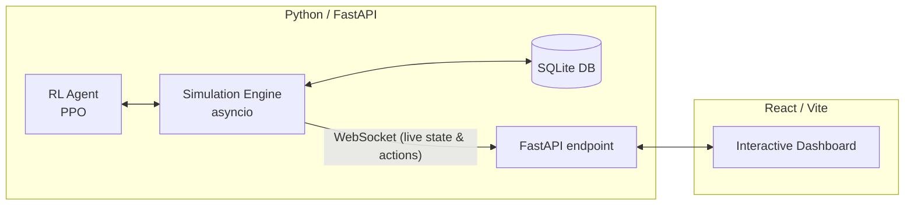

# ⚡ GridMind (formerly MC-IOT)
**AI-Powered Smart Neighbourhood Power Grid Simulation**

Welcome to **GridMind**—a full-stack, real-time energy management simulation. This project demonstrates how autonomous Reinforcement Learning (RL) agents can optimize energy consumption, battery storage, and EV charging within a residential microgrid to minimize costs and prevent blackouts.

---

## 🏗️ Architecture



The system uses direct integration between the asynchronous Python simulation engine and the FastAPI server, streaming telemetry data to the React dashboard via WebSockets.

---

## 🚀 Quick Start

### 1. Backend Setup

The backend runs the simulation loop and serves the WebSocket and REST endpoints.

```bash
cd backend
pip install -r requirements.txt
python -m api.main
```
> **Note**: The backend starts at `http://localhost:8000`.

### 2. Frontend Setup

The interactive dashboard is built with React, Vite, and TanStack.

```bash
cd frontend
npm install
npm run dev
```
> **Note**: The dashboard typically opens at `http://localhost:5173`.

### 3. (Optional) Train the RL Agent

Train the PPO agent from scratch using the Gymnasium environment.

```bash
cd backend
python -m ai.train --timesteps 100000
```

---

## 📊 Demo Scenarios

| Scenario | Controller | Expected Behavior |
|----------|-----------|-------------|
| 📉 **Baseline** | Rule-based (Thresholds) | Unstable loads, random battery usage, and high costs. |
| 🧠 **AI Agent** | RL (PPO) | Smooth curves, optimized battery cycles, and low costs. |
| 🌩️ **Stress Test** | AI under duress | Injects cloud cover & EV surge events. Watch the AI adapt vs the baseline! |

---

## 🤖 AI Component Details

* **Observation Space (10 dimensions)**: Hour, solar output, house load, EV demand, battery SOC, electricity price, net load, price tier, and available charge/discharge rates.
* **Action Space (2 continuous)**: Battery charge/discharge (-1.0 to +1.0) and EV throttle (0.0 to 1.0).
* **Reward Function**: Minimizes energy cost, penalizes grid blackouts, and prefers a healthy battery state-of-charge.

**What emerges**: The agent autonomously discovers real-world strategies—like charging the battery at noon (when solar is peak), discharging at 7 PM (peak pricing), and delaying EV charging to late night off-peak hours.

---

## 🗂️ Project Structure

```text
backend/
  ├── simulation/      # Device models, Gym environment, async simulator
  ├── ai/              # RL agent (PPO), rule-based controller, training scripts
  └── api/             # FastAPI app, WebSocket handlers, SQLite db connection
frontend/
  └── src/
      ├── components/  # React dashboard components & UI
      ├── routes/      # TanStack routing
      └── hooks/       # Custom WebSocket connection hook
```
