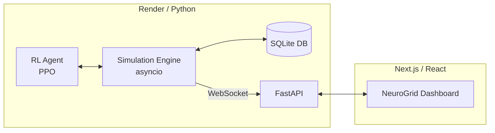

# ⚡ NeuroGrid
**AI-Powered Smart Neighbourhood Power Grid Simulation**

Welcome to **NeuroGrid**—a full-stack, real-time energy management simulation. This project demonstrates how autonomous Reinforcement Learning (RL) agents can optimize energy consumption, battery storage, and EV charging within a residential microgrid to minimize costs and prevent blackouts, specifically calibrated for the Indian energy market.

---

## 🏗️ Architecture



The system is a distributed application with a FastAPI/Python backend and a Next.js frontend, communicating via live WebSockets.

---

## 🚀 Deployment & Setup

### 🌍 Live Deployment
* **Backend:** [https://neurogrid-da21.onrender.com](https://neurogrid-da21.onrender.com)

### 🛠️ Local Development

#### 1. Backend Setup (Python 3.11+)
```bash
cd backend
pip install -r requirements.txt
python -m api.main
```
> **Note**: For cloud compatibility, use the CPU-only PyTorch index: `--extra-index-url https://download.pytorch.org/whl/cpu`

#### 2. Frontend Setup (Node.js)
```bash
cd frontend
npm install
npm run dev
```

---

## ⚙️ Simulation Configuration
The simulation is highly customizable via a central configuration file. You can alter neighborhood size, battery capacity, and electricity tariffs without touching the core logic.

**File:** `backend/simulation/config.py`

| Parameter | Default Value | Description |
|-----------|---------------|-------------|
| `NUM_HOUSES` | 6 | Total number of residential units. |
| `BATTERY_CAPACITY_KWH` | 50.0 | Capacity of the community battery. |
| `PRICE_PEAK_INR` | ₹12.00 | Peak electricity rate per kWh. |
| `TIME_ACCELERATION` | 120.0 | 1 real second = 2 simulated minutes. |

---

## 📊 Indian Energy Scenarios
Everything in NeuroGrid is calibrated in **Indian Rupees (₹)**.

| Scenario | Controller | Expected Behavior |
|----------|-----------|-------------|
| 📉 **Baseline** | Rule-based | High costs (₹), inefficient battery cycling. |
| 🧠 **AI Agent** | RL (PPO) | Optimized for TOU (Time of Use) tariffs. |
| 🌩️ **Stress Test** | AI under duress | Adapts to cloud cover and EV surges in real-time. |

---

## 🤖 AI Component Details

* **Observation Space**: Hour, solar, house load, EV demand, battery SOC, ₹ price, net load.
* **Action Space**: Battery charge/discharge (-1.0 to +1.0) and EV throttle (0.0 to 1.0).
* **Reward Function**: Minimizes ₹ cost, penalizes blackouts, and maintains battery health.

---

## 🗂️ Project Structure

```text
backend/
  ├── simulation/      # config.py, device models, async simulator
  ├── ai/              # RL agent (PPO), training scripts
  └── api/             # FastAPI app, WebSocket handlers
frontend/
  ├── public/          # Logo and Favicon assets
  └── src/
      ├── app/         # Next.js App Router (Layout, Page, Providers)
      ├── components/  # React dashboard components (₹ enabled)
      ├── hooks/       # WebSocket logic (NEXT_PUBLIC_WS_URL enabled)
      └── lib/         # Utility functions and error handling
```
